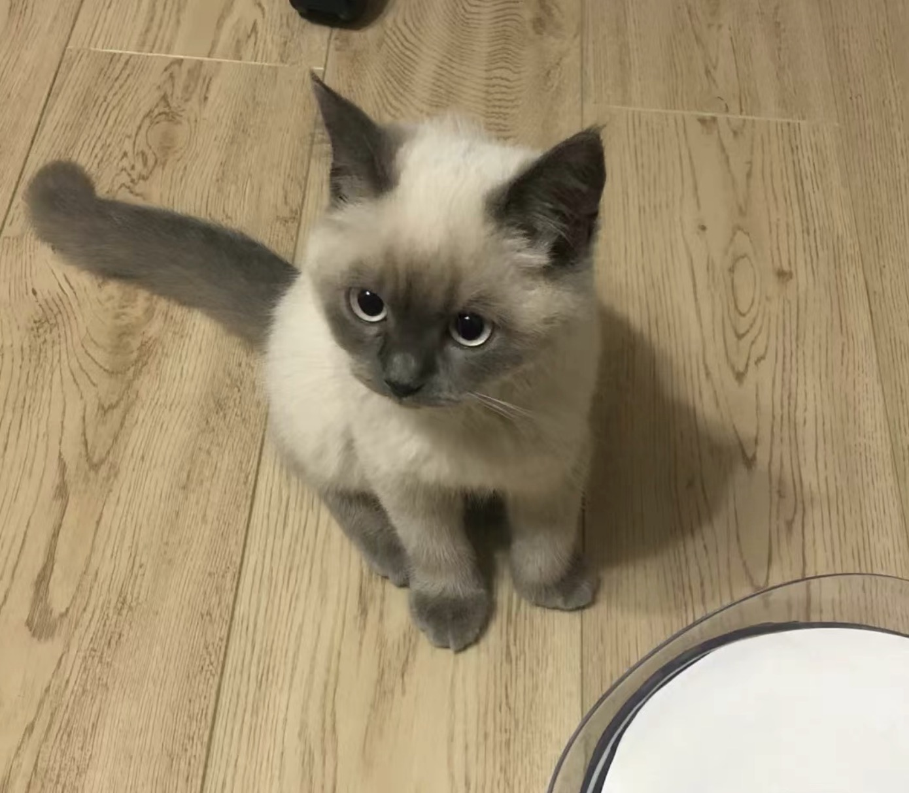
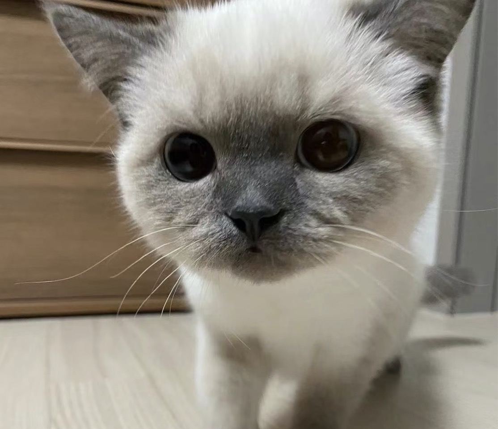

<Meting server="netease"
        type="playlist"
        mid="5312894314"
        :lrc-type="3"
        fixed
	autoplay
	loop="all"
	order="random"
	preload="auto"
	list-folded
        mini />

    

        

            <!-- 
            
            
            
            
            
             -->
            
            
            
            
            
            
            
        

    

