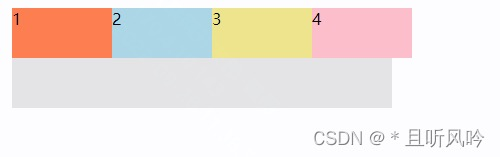

定义
---

flex-shrink 属性定义了项目的收缩规则。

**flex-shrink 主要处理当 flex 容器空间不足时候，单个元素的收缩比例。当父元素的宽度小于子元素宽度之和并且超出了父元素的宽度时，flex-shrink 就会按照一定的比例进行收缩：将子元素宽度之和与父元素宽度的差值按照子元素 flex-shrink 的值分配给各个子元素，每个子元素原本宽度减去按比例分配的值，其剩余值为实际宽度。**

flex 元素仅在默认宽度之和大于容器的时候才会发生收缩，其收缩的大小是依据 flex-shrink 的值。

注意：如果元素不是弹性盒对象的元素，则 flex-shrink 属性不起作用。

默认为1，即如果空间不足，该项目将缩小。

语法
---
```
.item {
  flex-shrink: number|initial|inherit; /* default 1 （负值对该属性无效） */
}
```

>number ：一个数字，规定项目将相对于其他灵活的项目进行收缩的量。默认值是 1
>
>initial：设置该属性为它的默认值。
>
>inherit：从父元素继承该属性。

如果所有项目的 flex-shrink 属性都为1，当空间不足时，都将等比例缩小。

如果一个项目的 flex-shrink 属性为0，其他项目都为1，则空间不足时，前者不缩小。

例子
---
[更多例子见CSDN原文](https://blog.csdn.net/HH18700418030/article/details/127006977)

1. flex-shrink 为 0 时，不压缩项目。

```
<!DOCTYPE html>
<html lang="en">
<head>
  <meta charset="UTF-8">
  <title>Title</title>
  <style>
    .container {
      display: flex;
      margin: 0px auto;
      width: 380px;
      height: 100px;
      background-color: #e6e6e6;
    }
    .item {
      /* flex-basis属性定义了项目占据主轴空间（main size）大小。 */
      flex-basis: 100px;
      height: 50px;
      /* flex-shrink 属性定义项目的缩小系数 */
      flex-shrink: 0;
    }
    .container div:nth-of-type(1) { background-color:coral;}
    .container div:nth-of-type(2) { background-color:lightblue;}
    .container div:nth-of-type(3) { background-color:khaki;}
    .container div:nth-of-type(4) { background-color:pink;}
  </style>
</head>
<body>
  <div class="container">
    <div class="item">1</div>
    <div class="item">2</div>
    <div class="item">3</div>
    <div class="item">4</div>
  </div>
</body>
</html>
```