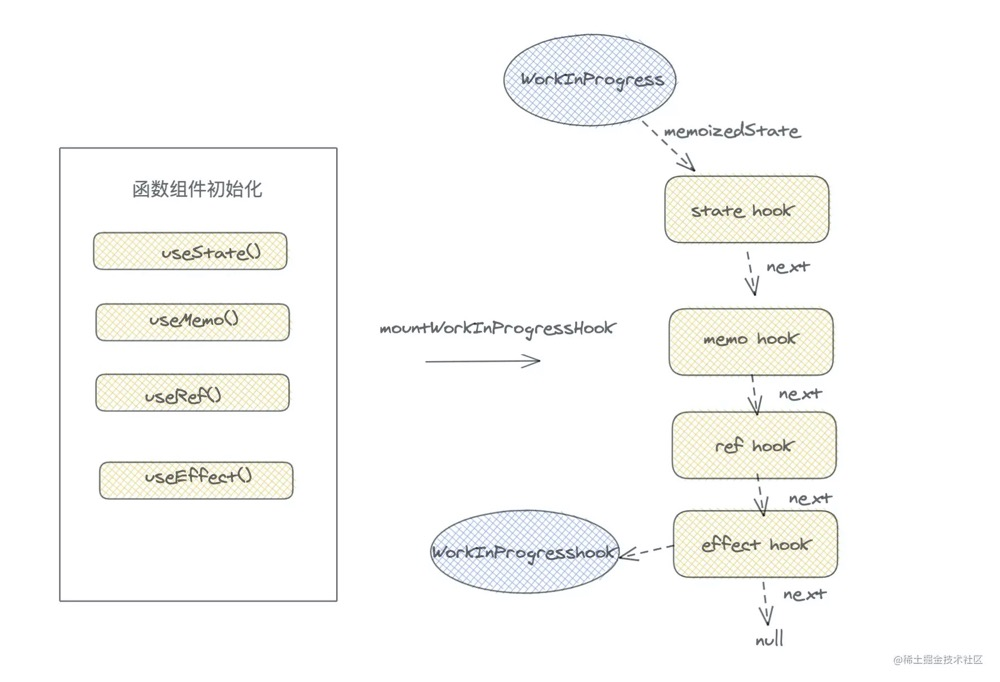

React-Hooks:
---
是函数组件解决没有state，生命周期，逻辑不能复用的一种技术方案。

Hook 是 React 16.8 的新增特性。它可以让你在不编写 class 的情况下使用 state 以及其他的 React 特性。

function和class组件本质的区别：
---
```
class Index extends Component<any,any>{
    constructor(props){
        super(props)
        this.state = {
            num: 0
        }
    }
    handleClick = () => {
        for(let i=0; i< 5; i++ ){
            setTimeout(()=>{
                this.setState({number: this.state.num+1})
                console.log(this.state.num)
            }, 1000)
        }
    }
    render() {
        return <div>
            <div onClick={this.handleClick}>num++</div>
        </div>
    }
}
export default Index;
```
打印结果： 1 2 3 4 5
```
function Index () {
    const [num, setNumber] = React.useState(0)
    const handleClick = () => {
        for(let i=0; i<5; i++){
            setTimeout(()=>{
                setNumber(num+1)
                console.log(num)
            }, 1000)
        }
    }
    return <div onClick={handleClick}>{num}</div>
}
```
打印结果：0 0 0 0 0

**对于class组件，只需要实例化一次，实例中保存了state等状态，每次更新只需要调用render方法即可。但是在function组件中，每一次更新都是一次新的函数执行，为了保存一些状态，执行一些副作用钩子，react-hooks应运而生，去帮助组件记录一些状态，处理一些额外的副作用。**

Hooks初始化：
---
```
useState  // 负责组件更新
useEffect // 执行副作用
useRef    // 保存数据
useMemo   // 缓存优化

useCallback
useReducer
useLayoutEffect
```
示例代码：
```
import React, { useState, useEffect, useMemo, useRef } from 'react';

function Index() {
    const [number, setNumber] = useState(0);
    const divDemo = useMemo(() => <div>hello, I am a divDemo.</div>, [])
    const curRef = useRef(null);
    useEffect(()=>{
        console.log(curRef.current)
    },[])
    return <div ref={ curRef }>
        hello world { number }
        { divDemo }
        <button onClick={() => setNumber(number+1)}>number ++</button>
    </div>
}
```
1. **mountWorkInProgressHook**

在组件初始化的时候，每一次hooks执行，如useState(), useEffect(), 都会调用mountWorkInProgressHook.

mountWorkInProgressHook做的事情：首先每次执行一个hooks函数，都产生一个hooks对象，里面保存了当前hook信息，然后将每个hooks以链表形式串联起来，并赋值给workInProgress的memoizedState。也就证明了函数组件用memoizedState存放hooks链表。

- memoizedState: 
    + useState：保存state信息
    + useEffect：保存effect对象
    + useRef：保存ref对象
    + useMemo：保存缓存的值和deps
- baseQueue: useState和useEffect中保存最新的更新队列。
- baseState: useState和useEffect中，一次更新中，产生的最新的state值。
- queue: 保存待更新队列pendingQueue，更新函数dispatch等信息。
- next: 指向下一个hooks对象。
<div style="text-align:center">
    
</div> 

**不能在条件语句中声明hooks:** 因为一旦在条件语句中声明hooks，在下一次函数组件更新，hooks链表结构，将会被破坏，current树的memoizedState缓存hooks信息，和当前workInProgress不一致，如果涉及到读取state等操作，就会发生异常。

<font color="#dd0000">🌟总结：hooks是通过什么证明唯一性的？答：通过hooks链表顺序。</font>

2. **useState => mountState**

在无状态组件中，useState和useReducer触发函数更新的方法都是dispatchAction，useState可以看成是一个简版的useReducer。

dispatchAction无状态组件更新机制: dispatchAction就是setNumber。

- 无论是类组件调用setState，还是函数组件的dispatchAction，都会产生一个update对象，里面记录了此次更新的信息，然后将此update放入待更新的pending队列中。dispatchAction的第二步就是判断当前函数组件的fiber对象是否处于渲染阶段。如果处于渲染阶段，那么不需要我们更新当前函数组件，只需要更新当前的update和expirationTime即可。
- 如果当前fiber没有处于更新阶段，那么通过调用lastRenderedReducer获取最新state，和上一次的currentState进行浅比较，如果相等，就退出。证实了useState两次值相等的时候组件就不进行渲染了，这和Component模式下的setState有一定的区别。
- 如果两次state不相等，调用scheduleUpdateOnFiber调度渲染当前fiber，<font color="#dd0000">scheduleUpdateOnFiber</font>是react渲染更新的主要函数。

3. **useEffect => mountEffect**

每个hooks初始化都会创建一个hook对象，然后将hook的memoizedState保存当前的effect hook信息。

有两个memoizedState不要混淆
- workInProgress / current 树上的memoizedState保存的是当前函数组件每个hooks形成的链表。
- 每个hooks上的memoizedState保存的是当前hooks的信息，不同种类的hooks的memoizedState内容不同。

pushEffect