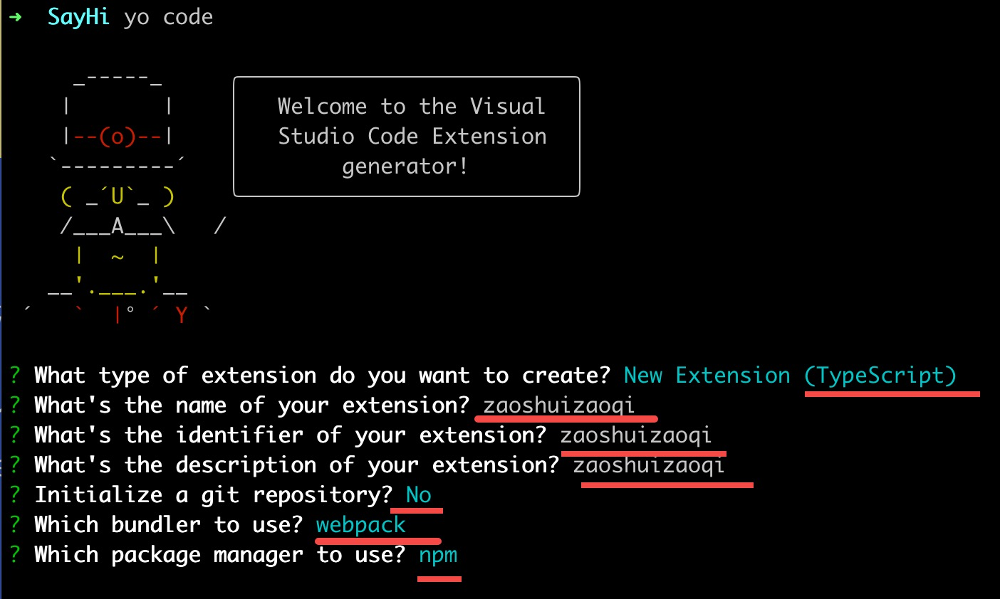

镜像
---
```bash
npm config set registry https://registry.npmmirror.com
```
安装
---
```bash
sudo npm install -g yo generator-code
yo code
```


package.json
---
```json
{
  "name": "xxxx",
  "displayName": "xxxx",
  "description": "xxxx",
  "version": "0.0.1",
  "publisher": "vscode user id (name)",
  "engines": {
    "vscode": "^1.54.0"
  },
  // 删除 repository 可以对外隐藏插件代码仓库地址
  "repository": {
    "type": "git",
    "url": "git@github.com:xxx/xxx.git"
  },
  "categories": [
    "Other"
  ],
  "main": "./dist/extension.js",
  /** 激活事件 - 调用命令执行 */
  "activationEvents": [
    "onCommand:extension.xxx",
    // 多个命令
    // "onCommand:extension.xxx",
    // "onCommand:extension.xxx",
    "onStartupFinished"
  ],
  /** 激活事件 - 自动激活扩展 */
  // "activationEvents": ["*"],
  "activationEvents": [],
  // 配置命令，命令id唯一，可以配置多个
  "contributes": {
    "commands": [
      {
        "command": "xxxx.xxx",
        "title": "XXX"
      },
      // 多个命令
      // {
      //   "command": "xxxx.xxx",
      //   "title": "XXX"
      // },
      // {
      //   "command": "xxxx.xxx",
      //   "title": "XXX"
      // }
    ]
  },
  "scripts": {
    "vscode:prepublish": "npm run package",
    "compile": "webpack",
    // 本地调试运行 npm run watch
    "watch": "webpack --watch",
    "package": "webpack --mode production --devtool hidden-source-map",
    "compile-tests": "tsc -p . --outDir out",
    "watch-tests": "tsc -p . -w --outDir out",
    "pretest": "npm run compile-tests && npm run compile && npm run lint",
    "lint": "eslint src",
    "test": "vscode-test"
  },
  "devDependencies": {
    "@types/vscode": "^1.54.0",
    "@types/mocha": "^10.0.9",
    "@types/node": "20.x",
    "@typescript-eslint/eslint-plugin": "^8.10.0",
    "@typescript-eslint/parser": "^8.7.0",
    "eslint": "^9.13.0",
    "typescript": "^5.6.3",
    "ts-loader": "^9.5.1",
    "webpack": "^5.95.0",
    "webpack-cli": "^5.1.4",
    "@vscode/test-cli": "^0.0.10",
    "@vscode/test-electron": "^2.4.1"
  }
}
```

Submit
---
绑定github仓库提交代码
```bash
git add . && git commit -m 'feat: release plugin' && git push
```

发布
---
- 安装vsce
```bash
npm i vsce -g
```
- 创建个人访问令牌、创建组织
`https://learn.microsoft.com/zh-cn/azure/devops/organizations/projects/create-project?view=azure-devops&tabs=browser`
- 登陆vsce
```bash
vsce login <publisher name>
```
- 打包
```bash
vsce package
```
- 发布
```bash
vsce publish
```
去vscode插件市场上传打包出来的 .vsix 包即可。 `https://marketplace.visualstudio.com/manage/publishers/lynsey`

- 版本

执行命令后自动在 package.json 的 version 版本基础上递增，可手动修改当前版本号，然后执行vsce publish发布。  
如版本已存在，可以删除，使用 `git tag -d v0.0.4`、`git push origin --delete v0.0.4`清除已有版本。如打包完的名称可能重复，可提前删除或修改已打包的文件名。  

  - 只打包不发布：`vsce package`，本地打包出一个.vsix包
  - 补丁版本：`vsce publish patch`, **# 版本 +0.0.1**，0.0.1 -> 0.0.2 小修复
  - 次版本：`vace publish minor`, **# 版本 +0.1.0**，0.0.1 -> 0.1.1 新功能
  - 主版本：`vsce publish major`, **# 版本 +1.0.0**，0.0.1 -> 1.0.1 重大更新

  - 指定版本发布：`vsce publish 2.3.4`
  - 预发布版本：`vsce publish -pre-release`

- 回滚
vscode 插件市场不支持回滚，可以重新发布补丁版本，可以手动修改版本号再发布等。