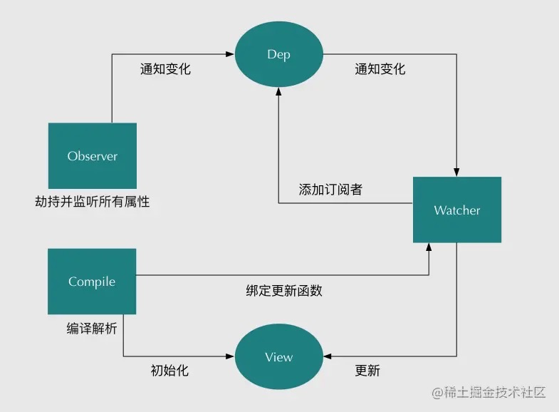

## 深入响应式原理

待补充。。。


1.Vue基本原理
---------------------------------------------------------------------------------
当一个Vue实例创建时，Vue会遍历Data中的属性，用Object.defineProperty(Vue3.0使用Proxy)将它们转化为getter/setter，并且在内部追踪相关依赖，在属性被访问和修改时通知变化。每个组件实例都有相应的watcher程序实例，它会在组件渲染的过程中把属性记录为依赖，之后当依赖项的setter被调用时，会通知watcher重新计算，从而致使它关联的组件得已更新。
<div style="text-align:center">
    
</div> 

2.双向数据绑定原理
---------------------------------------------------------------------------------
Vue.js是采用数据劫持结合发布-订阅模式的方式，通过Object.defineProperty()来劫持各个属性的getter，setter，在数据变动时发布消息给订阅者，触发相应的监听回调。主要分为以下几个步骤：

1. 需要observe的数据对象进行递归遍历，包括子属性对象的属性，都加上setter和getter这样的话，给这个对象的某个值赋值，就会触发setter，那么就能监听到了数据变化
2. compile解析模板指令，将模板中的变量替换成数据，然后初始化渲染页面视图，并将每个指令对应的节点绑定更新函数，添加监听数据的订阅者，一旦数据有变动，收到通知，更新视图
3. Watcher订阅者是Observer和Compile之间通信的桥梁，主要做的事情是: ①在自身实例化时往属性订阅器(dep)里面添加自己 ②自身必须有一个update()方法 ③待属性变动dep.notice()通知时，能调用自身的update()方法，并触发Compile中绑定的回调，则功成身退。
4. MVVM作为数据绑定的入口，整合Observer、Compile和Watcher三者，通过Observer来监听自己的model数据变化，通过Compile来解析编译模板指令，最终利用Watcher搭起Observer和Compile之间的通信桥梁，达到数据变化 -> 视图更新；视图交互变化(input) -> 数据model变更的双向绑定效果。
<div style="text-align:center">
    
</div> 

3.使用Object.defineProperty()进行数据劫持的缺点
---------------------------------------------------------------------------------
在对一些属性进行操作时，这种方式无法拦截，比如通过下标修改数组或者给对象新增属性，都不能触发组件的重新渲染，因为Object.defineProperty()不能拦截这些操作。更精确地说，对于数组而言，大部分操作时拦截不到的，只是Vue通过内部重写函数的方式解决了这个问题。

Vue3.0中已经不使用这个方法了，而是通过Proxy对对象进行代理，从而实现数据劫持。使用Proxy的好处是它可以监听到任何方式的数据改变，唯一的缺点就是兼容性问题，Proxy是ES6的语法。

4.MVVM、MVC、MVP的区别
---------------------------------------------------------------------------------
MVVM、MVC、MVP是是三种常见的软件架构设计模式。主要通过分离关注点的方式来组织代码结构，优化开发效率。

**背景：** 在开发单页面应用时，往往一个路由页面对应了一个脚本文件，所有的页面逻辑都在一个脚本文件里。页面的渲染、数据的获取，对用户事件的响应所有的应用逻辑都混合在一起，这样在开发简单项目时，可能看不出什么问题，如果项目变得复杂，那么整个文件就会变得冗长、混乱，这样对项目开发和后期的项目维护是非常不利的。

1. MVC（Model View Controller）

View和Model应用了观察者模式，当Model层发生改变的时候他会通知View层更新页面，而Controller是Mode层和View层的纽带，主要负责用户与应用的响应操作，当用户与页面产生交互时，Controller的事件触发器开始工作，调用Model层，来完成对Model层的修改，然后Model层再去通知View更新。

2. MVVM（Model View ViewModel）

- Model代表数据模型，数据和业务逻辑都在Model层中定义；
- View代表UI视图，负责数据的展示；
- ViewModel负责监听Model中数据的改变并且控制视图的更新，处理用户交互操作；

这种模式实现了 Model和View的数据自动同步，因此开发者只需要专注于数据的维护操作即可，而不需要自己操作DOM。
<div style="text-align:center">
    
</div> 

3. MVP（Model View Presenter）

- 各部分之间的通信，都是双向的；
- View和Model不发生联系，都是通过Presenter传递。可以将一个presenter用于多个视图，而不需要改变Presenter的逻辑。这个特性非常有用，因为视图的变化总是要比模型变化频繁；
- View非常薄，不部署任何业务逻辑，被称为“被动视图”，既没有任何主动性。Presenter非常厚，业务逻辑都在那里。
> 缺点：
> 由于对视图的渲染都放在了presenter里，两者的交互就比较频繁。一旦视图需要变更，Presenter也需要变更。

5.Computed和Watch的区别
---------------------------------------------------------------------------------
#### Computed:
+ 支持缓存，只有当依赖数据发生了变化，才会重新计算；
+ 不支持异步，当Computed中有异步操作时，无法监听数据的变化；
+ Computed值默认走缓存，计算属性是基于他们的响应式依赖进行缓存的，也就是基于data声明过，或者父组件传递过来的props数据进行计算的；
+ 如果一个属性是由其他属性计算而来的，这个属性依赖其他属性，一般会使用Computed；
+ 如果属性值是函数，默认使用get方法，函数的返回值就是属性的属性值；在Computed中，有一个get和set方法，当数据发生变化时，会调用set方法；

#### Watch：
- 不支持缓存，数据变化时，就触发相应操作；
- 支持异步监听；
- 监听的函数接收两个参数，最新的值和变化前的值；
- 监听的数据必须是data中声明的或者父组件props中带传递过来的，当发生变化时，会触发其他操作，函数有两个参数：
    + immediate: 组件加载立即触发回调函数；
    + deep: 深度监听，发现数据内部的变化，在复杂数据类型中使用，例如数组中的对象发生变化。需要注意的是，deep无法监听到数组和对象内部的变化。

#### 总结：
- computed 计算属性 : 依赖其它属性值，并且 computed 的值有缓存，只有它依赖的属性值发生改变，下一次获取 computed 的值时才会重新计算 computed 的值。
- watch 侦听器 : 更多的是**观察**的作用，**无缓存性**，类似于某些数据的监听回调，每当监听的数据变化时都会执行回调进行后续操作。

**运用场景：**

- 当需要进行数值计算,并且依赖于其它数据时，应该使用 computed，因为可以利用 computed 的缓存特性，避免每次获取值时都要重新计算。
- 当需要在数据变化时执行异步或开销较大的操作时，应该使用 watch，使用 watch 选项允许执行异步操作 ( 访问一个 API )，限制执行该操作的频率，并在得到最终结果前，设置中间状态。这些都是计算属性无法做到的。

6.Computed和Methods区别
---------------------------------------------------------------------------------
相同点：

可以将同一函数定义为一个method或者一个计算属性，其最终的结果，两种方式是相同的。

不同点：

- Computed：计算属性是基于它们的依赖进行缓存的，只有当相关依赖项发生改变时，才会去重新计算；
- Method：在调用时总会执行该函数。

7.slot
---------------------------------------------------------------------------------
#### 概念
插槽，Vue的内容分发机制。组件内部的模版引擎是使用slot元素作为承载分发内容的出口。插槽slot是子组件的一个模板标签元素，而这个标签元素是否显示，如何显示，是有父组件决定的。

#### 分类
+ 默认插槽：匿名插槽，slot没有指定name属性，一个组件只有一个默认插槽；
+ 具名插槽：指定name属性的slot，一个组件可以有多个具名插槽；
+ 作用域插槽：是匿名插槽和具名插槽的一个变体，不同点是子组件内部数据可以传递给父组件，父组件根据这个数据决定如何渲染该插槽；

#### 实现原理
当子组件vm实例化时，获取到父组件传入的slot标签内容，放在[vm.$slot]()中，默认插槽为[vm.$slot.default]()，具名插槽为[vm.$slot.xxx]()，当组件执行渲染函数时，遇到slot标签，使用$slot中的内容进行替换，此时可以为插槽传递数据，如果存在数据，则可称为作用域插槽。

8.过滤器
---------------------------------------------------------------------------------
过滤数据，Vue中使用filters来过滤数据，不会改变数据，只是过滤数据，改变用户看到的输出（Computed、Methods都是通过修改数据来处理数据的输出显示）。

**使用场景：**
- 价格、时间等的格式化显示；
- 根据日期，显示比如多少天前之类的输出展示，可以使用filters过滤器来处理数据；

#### 如何实现一个过滤器？

过滤器是一个函数，用在插值表达式{{}}和v-bind表达式中。然后放在操作符“｜”后面进行指示。
```
<div>价格：{{price | filterPrice}}</div>

filters: {
    filterPrice (price) {
        return price ? '¥' + price : '---'
    }
}
```

9.如何保存页面当前的状态
---------------------------------------------------------------------------------
两种情况：组件会被卸载或不会被卸载

#### 组件会被卸载：
1. 使用LocalStorage / SessionStorage

    在组件即将销毁的生命周期（componentWillUnmount / beforeDestroy）使用此方法，需要注意的是组件更新状态的时机。

    **优点：**
    - 兼容性好，不需要引入第三方库或者工具；
    - 简单快捷，可以满足大部分需求；

    **缺点：**
    - 状态通过JSON存储（相当于深拷贝），如果状态中有特殊情况（Date对象/Regexp对象）会得到字符串而不是原来的值；
    - 使用标示flag时，执行后退、下一页等操作会失效；
2. 路由传参

    使用react-router的link，prop -- to 实现路由传递参数，通过history.location.state获取

    **优点：**
    - 简单快捷，不会污染LocalStorage/SessionStorage;
    - 可以存储Date对象和Regexp对象；（不用担心JSON.stringify()和parse()的不足）
    
    **缺点：**
    - 如果跳转页面过多，每个页面都需要使用同样的方法进行传值取值，相当冗余混乱；

#### 组件不会被卸载：
1. 单页面页面渲染

    父子组件正常传参（prop）的方式

    **优点：**
    - 代码量少，方便

    **缺点：**
    - 无法用路由定位页面

2. keep-alive

   \<keep-alive\> 包裹动态组件时，会缓存不活动的组件实例，而不是销毁他们。是一个抽象组件，它自身不会渲染一个组件，也不会出现在组件的父组件链中。

    主要用于保存组件状态或避免重新渲染。
    ```
    <keep-alive>
        <component :is="view"></component>
    </keep-alive>
    ```

    ```
    <keep-alive>
        <component v-if="$router.meta.keepAlive"></component>
    </keep-alive>

    // router.js
    {
        path: '/',
        name: '',
        component: () => import('./../src/XXX.vue'),
        meta: {
            keepAlive: true // 需要被缓存
        }
    }
    ```

10.常见的事件修饰符
---------------------------------------------------------------------------------
- .stop: 阻止事件冒泡
```
<div v-on:click.stop="doThis"></div>
```

- .prevent: 阻止默认行为
```
// 提交事件不再重载页面
<form v-on:submit.prevent="doSubmit"></form>
// 只有修饰符
<form v-on:submit.prevent></form>
```
修饰符可以串联：
```
<div v-on:click.stop.prevent="doThat"></div>
```

- .capture: 与事件冒泡相反，事件捕获由外到内；
```
<div v-on:click.capture="doThis"></div>
```

- .self: 只会触发自己范围内的事件，不包含子元素；

阻止所有点击：
```
<div v-on:click.prevent.self="doThis"></div>
```
只阻止元素对自身的点击
```
<div v-on:click.self.prevent="doThis"></div>
```

- .once: 只触发一次，还能被用到自定义的组件事件上。
```
<div v-on:click.once="doThis"></div>
```

- .passive: 滚动事件的默认行为将会立即触发，不会等待onScroll完成，这其中包含 `event.preventDefault()` 的情况
```
<div v-on:scroll.passive="onScroll"></div>
```

11.v-if、v-show、v-html原理
---------------------------------------------------------------------------------
#### v-html
更新元素的innerHTML。按普通HTML插入，不会进行Vue模板编译。
>1、coped样式不会应中在v-html内部, 因为那部分HTML不会进行Vue模板编译；
>
>2、在网上站动态渲染HTML是非常危险的，容易导致XSS攻击。只在可信内容上使用v-html，永不用在提交内容上。
```
<div v-html="html"></div>
```

#### v-show
条件渲染，display: none，会生成vnode，render的时候会渲染真实节点，只是在render的过程中会修改属性display

#### v-if
根据表达式值的truthiness来有条件渲染元素。在切换元素及它他的数据绑定/组件被销毁或重建。
>当v-if和v-for一起使用，v-for的优先级高。

#### v-if和v-show的区别
1. v-if是dom操作，添加或删除dom元素，有局部编译/卸载的过程，v-show是改变css的display；
2. v-if用于运行条件不经常改变的场景，v-show适用于频繁变化；
3. v-if是惰性的，第一次如果不为真不进行编译，只有当条件第一次为真时才开始局部编译，v-show在任何条件下都会被编译，然后被缓存，dom元素保留；
4. v-if有更高的切换消耗，v-show有更高的初始渲染消耗；

12.v-model
---------------------------------------------------------------------------------
数据双向绑定，本质是语法糖，背后的操作有两个：
- v-bind绑定value；
- v-on给当前元素绑定不同的事件；
> text和textarea绑定input事件；
>
> checkbox、radio和select绑定change事件；

#### 修饰符
1. .lazy : change时更新
v-model在每次input事件触发后将输入框的值与数据进行绑定，加上.lazy后转为在change事件之后进行同步
```
<input v-model.lazy="msg">
```

2. .number : 输入值转为数值类型
```
<input v-model.number="age" type="number">
```
因为即使在type定义为number，HTML输入元素的值也会总会返回字符串。如果这个值无法被parseFloat()解析，则会返回原始的值。

3. .trim : 自动过滤首尾空格
```
<input v-model.trim="msg">
```

#### 自定义组件的v-model
```
Vue.component('custom-checkbox', {
    model: {
        prop: 'checked',
        event: 'change'
    },
    props: {
        checked: Boolean
    },
    template: `
        <input
            type="checkbox"
            v-bind:checked="checked"
            v-on:change="$emit('change', $event.target.checked)"
        >
    `
})
```

#### .sync修饰符
**作用：** 可以实现子组件与父组件的双向绑定，并且可以实现子组件同步修改父组件的值。

**本质：** 
正常父传子：
```
<son :a="a" :b="b"></son>
```
加上.sync后父传子
```
<son :a.sync="a" :b.sync="b"></son>
```
它等价于
```
<son
    :a="a"
    :b="b"
    @update:a="val => a = val"
    @update:b="val => b = val"
></son>
```
相当于多了一个事件监听，事件名为update:a, 回调函数中，会把接收到的值赋给属性绑定的数据项中。

#### .sync与v-model的区别
**相同点：** 都是语法糖

**不同点：** 
- 格式写法不同，都可以实现父子组件的数据双向通信。
> ```
> v-model="num"
> :num.sync="num"
>
> v-model: @input + value
> :num.sync: @update:num 
> ```
- v-model只能有一个，.sync可以有多个

13.为什么Vue的data属性是一个函数而不是对象
---------------------------------------------------------------------------------
#### 实例和组件定义的区别
- 实例定义既可以是对象，也可以是函数
```
const app = new Vue({
    el: "#app",
    // 对象格式
    data: {
        foo: 'foo'
    },
    // 函数格式
    data () {
        return {
            foo: 'foo'
        }
    }
})
```
- 组件定义只能是函数

如果为组件的data直接定一个对象
```
Vue.component({
    template: `<div>组件</div>`,
    data: {
        foo: 'foo'
    }
})
```
会看到报错信息：
```
[Vue warn]: The "data" option should be a function that returns a per-instance value in component defintions.
```

#### 原因：

根实例是单例，不会产生数据污染的情况。
如果一个组件有多个Vue实例，就会造成多个组件实例对象共用一个data对象（共用一个内存地址，对象A的值发生改变，同样对象B的值也发生改变），产生数据污染，而使用函数，初始化data时，就会返回全新的data对象。

14.对keep-alive的理解，如何实现，具体缓存的是什么
---------------------------------------------------------------------------------
1. 概念
如果需要在组件切换的时候，保留一些组件的状态防止多次渲染，就需要使用\<keep-alive\>包裹需要保存的组件。

用法
```
<keep-alive> // 基本
    <component :is="view"></component>
</keep-alive>
```
```
<keep-alive> // 多个条件判断的子组件
    <compo-a v-if="a > 1"></compo-a>
    <compo-b v-else></compo-b>
</keep-alive>
```

2. Props
- includes: 只能缓存名称匹配的组件
- exculdes: 任何名称匹配的组件都不会被缓存
- max: 最多可以缓存组件实例的个数

\<keep-alive\>包裹动态组件时，会缓存不活动的组件实例，而不是销毁它们。

当组件在\<keep-alive\>内被切换时，生命周期 activated 和 deactivated 会被调用。

3. render函数
- 会在\<keep-alive\>组件内部去写自己的内容，所以可以获取slot的内容，然后根据这个去获取组件
- \<keep-alive\>只对第一个组件有效，所以只获取第一个子组件
- 和\<keep-alive\>搭配使用的一般有：动态组件和router-view

内容待更新……

#### LRU （least recently used）缓存策略

LRU 缓存策略∶ 从内存中找出最久未使用的数据并置换新的数据。
LRU（Least rencently used）算法根据数据的历史访问记录来进行淘汰数据，其核心思想是 "如果数据最近被访问过，那么将来被访问的几率也更高"。 最常见的实现是使用一个链表保存缓存数据，详细算法实现如下∶

- 新数据插入到链表头部
- 每当缓存命中（即缓存数据被访问），则将数据移到链表头部
- 链表满的时候，将链表尾部的数据丢弃。

15.$nextTick的原理和作用
---------------------------------------------------------------------------------
1. 全局方法
将回调推迟到下一个DOM更新周期后执行。在更改了一些数据等待DOM更新后立即使用它。
```
import { createApp, nextTick } from 'vue'
const App = createApp({
    setUp () {
        const message = ref('Hello')
        const changeMessage = async newMessage => {
            message.value = newMessage
            await nextTick()
            console.log('DOM updated')
        }
    }
})

```
2. 实例方法
它跟全局方法 nextTick 一样，不同的是回调的 this 自动绑定到调用它的实例上。
```
createApp({
    methods: {
        doSomeThing() {
            this.message = 'message'
            // dom未更新
            this.$nextTick(function(){
                // dom更新了，this被绑定到当前实例
                this.forExample()
            })
        }
    }
})
```

---------------------------------------------------------------------------------

---------------------------------------------------------------------------------

---------------------------------------------------------------------------------