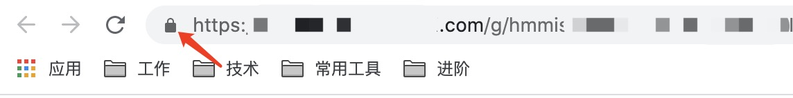
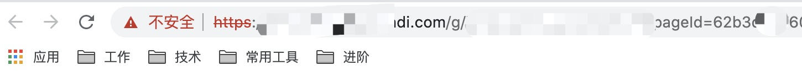

### HTTPS网页发送HTTP请求
---

项目从http升级到https后，需要请求http接口时会出现异常：

Mixed Content: The page at 'https://xxx.xxx.com/g/hmmis/xxx/' was loaded over HTTPS, but requested an insecure XMLHttpRequest endpoint 'http://xxx.xxx.com.cn/mock/'. This request has been blocked; the content must be served over HTTPS.

Access to XMLHttpRequest at 'http://xxx.xxx.com/finance/ticket/xx/xx/express/update' from origin 'https://xxx.xxx.com' has been blocked by CORS policy: Request header field sso-user is not allowed by Access-Control-Allow-Headers in preflight response.

https地址中，如果加载了http资源，浏览器将认为这是不安全的资源，将会默认阻止。

由于某些原因，项目中无法更换协议，所以直接替换https的方法是不可行的

上网查找到一些资料

#### 静态资源：
1. 在jsp页面中，添加下面的meta头就可以了
```
<meta http-equiv="Content-Security-Policy" content="upgrade-insecure-requests" />
```

这是网上的例子：
```
<%@ page language="java" contentType="text/html; charset=UTF-8" pageEncoding="UTF-8" %>
<!DOCTYPE html PUBLIC "-//W3C//DTD HTML 4.01 Transitional//EN" "http://www.w3.org/TR/html4/loose.dtd">
<html>
<head>
    <meta http-equiv="Content-Security-Policy" content="upgrade-insecure-requests">
</head>
<body>
<script type="text/javascript">
</script>
</body>
</html>
```
2. img标签的http地址
```
const img = new Image()
img.src = 'http://xxx/xxx/xxx/xx'
document.body.append(img)
```
可以正常显示图片

#### 动态接口：
一、以为了满足在本地调试场景需求为例：
1. 在网页url左侧小图标里设置：找到不安全的内容，改为：允许。

<div style="text-align:center">
    
</div> 

回到网页，chrome会提醒需要reload，点击reload即可

设置好是这个样子
<div style="text-align:center">
    
</div> 

2. 配合解决跨域的扩展程序, 如allow-control-allow-origin

二、XHR2

HTML5中提供的XMLHTTPREQUEST Level2（及XHR2）已经实现了跨域访问。但ie10以下不支持

只需要在服务端填上响应头：

header("Access-Control-Allow-Origin:*"); /*星号表示所有的域都可以接受，*/
header("Access-Control-Allow-Methods:GET,POST");

三、代理，由于我遇到问题的项目中所使用的node中间层跟要请求的http接口不在一个环境上，所以只能由前端通过其他方式解决了。