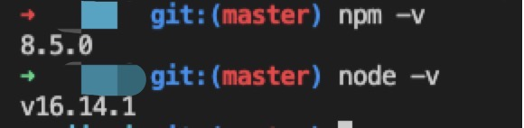

<!--
 * @Author: dreamlixia 1763112943@qq.com
 * @Date: 2022-06-30 23:37:16
 * @LastEditors: dreamlixia 1763112943@qq.com
 * @LastEditTime: 2022-07-01 00:21:17
 * @FilePath: /MyBlog/blog/docs/src/前端/基础知识/npm i报无法解析dom树错误解决.md
 * @Description: 这是默认设置,请设置`customMade`, 打开koroFileHeader查看配置 进行设置: https://github.com/OBKoro1/koro1FileHeader/wiki/%E9%85%8D%E7%BD%AE
-->
### npm ERR! code ERESOLVE
---
npm ERR! ERESOLVE unable to resolve dependency tree

我们在想要运行项目去安装项目依赖的时候，出现报错如下：
```
npm ERR! code ERESOLVE
npm ERR! ERESOLVE unable to resolve dependency tree
npm ERR! 
npm ERR! While resolving: jiazi@0.0.0
npm ERR! Found: react@17.0.2
npm ERR! node_modules/react
npm ERR!   react@"^17.0.0" from the root project
npm ERR! 
npm ERR! Could not resolve dependency:
npm ERR! peer react@"^16.6.3" from react-file-viewer@1.2.1
npm ERR! node_modules/react-file-viewer
npm ERR!   dev react-file-viewer@"^1.2.1" from the root project
npm ERR! 
npm ERR! Fix the upstream dependency conflict, or retry
npm ERR! this command with --force, or --legacy-peer-deps
npm ERR! to accept an incorrect (and potentially broken) dependency resolution.
npm ERR! 
npm ERR! See /Users/didi/.npm/eresolve-report.txt for a full report.

npm ERR! A complete log of this run can be found in:
npm ERR!     /Users/didi/.npm/_logs/2022-06-24T03_03_49_788Z-debug-0.log
```

不能解析依赖树 ，需要先修复上面依赖关系冲突或者重新执行一下npm install命令

因为高版本的比低版本的严格，所以会报错

1. 查看本机 npm 版本
```
npm -v
node -v
```
<div style="text-align:center">
    
</div> 

2. 降低 npm 版本
```
npm install npm@6.14.10 -g
```

3. 项目中删除文件: node-modules文件夹和package-lock.json文件删除

4. 重新npm install