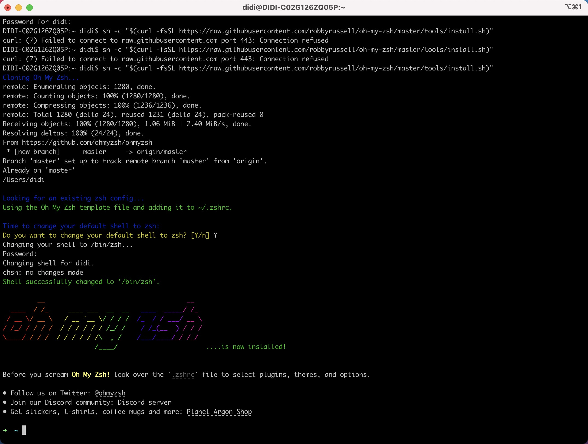

<!--
 * @Author: your name
 * @Date: 2022-06-21 17:47:35
 * @LastEditTime: 2022-06-21 18:38:56
 * @LastEditors: Please set LastEditors
 * @Description: 打开koroFileHeader查看配置 进行设置: https://github.com/OBKoro1/koro1FileHeader/wiki/%E9%85%8D%E7%BD%AE
 * @FilePath: /Blog/docs/src/前端/基础知识/为item2安装ohmyzsh配色方案报错的解决.md
-->

### 安装item2配色方案oh-my-zsh报错解决:
---

```
$ sh -c "$(curl -fsSL https://raw.githubusercontent.com/robbyrussell/oh-my-zsh/master/tools/install.sh)"
```
看到报错：
```
curl: (7) Failed to connect to raw.githubusercontent.com port 443: Connection refused
```
打开网站：

https://www.ipaddress.com/

查询raw.githubusercontent.com对应的IP地址

可以看到
```
Hostname Summary
Domain	githubusercontent.com
Domain Label	githubusercontent
IP Addresses	4 × IPv4 and 4 × IPv6
Web Server Location	2 locations in 🇺🇸 United States
```
找到对应的IP Addresses， 打开/etc/hosts文件进行编辑，填入内容
```
# IPv4
185.199.108.133 raw.githubusercontent.com
185.199.109.133 raw.githubusercontent.com
185.199.110.133 raw.githubusercontent.com
185.199.111.133 raw.githubusercontent.com
# IPv6
2606:50c0:8000::154 raw.githubusercontent.com
2606:50c0:8001::154 raw.githubusercontent.com
2606:50c0:8002::154 raw.githubusercontent.com
2606:50c0:8003::154 raw.githubusercontent.com
```
保存

重新执行上面的命令
```
$ sh -c "$(curl -fsSL https://raw.githubusercontent.com/robbyrussell/oh-my-zsh/master/tools/install.sh)"
```
即可下载完成oh-my-zsh

<div style="text-align:center">
    
</div> 