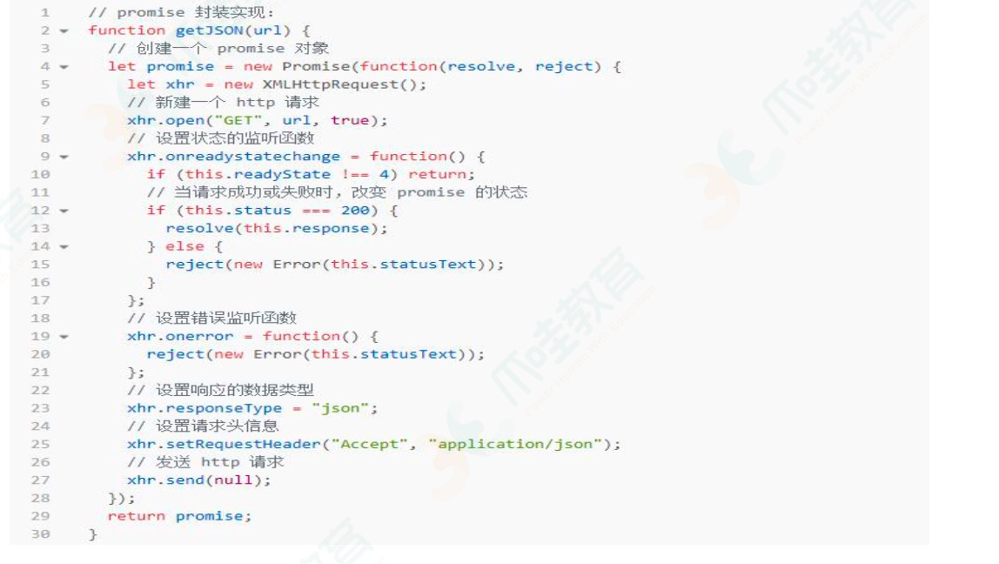

手写Object.create
---
思路：将传入的对象作为原型
```js
function create(obj) {
    function F() {}
    f.prototype = obj
    return new F()
}
```
防抖(debounce)
---
[本博客面试题模块有解析](https://dreamlixia.github.io/blog/#/src/%E9%9D%A2%E8%AF%95%E9%A2%98/JavaScript.html#%E9%98%B2%E6%8A%96-debounce)

不管事件的触发频率有多高，一定在事件触发后的n秒后才执行，如果在n秒内再次触发了事件，那么以新的时间为准，n秒后再执行。
```js
function debounce(event, time) {
    let timer = null
    return function(...args) {
        if(timer) clearTimeout(timer)
        timer = setTimeout(() => {
            event.apply(this, args)
        }, time)
    }
}
```
有时候需要立即执行一次，再等后面事件触发后等待n秒执行。
```js
function debounce1(event, time) {
    let timer = null
    let flag = true
    return function(...args) {
        if(flag && !timer) {
            event.apply(this, args)
            flag = false
        }
        if(timer) clearTimeout(timer)
        timer = setTimeout(() => {
            event.apply(this, args)
        }, time)
    }
}
```
节流(throttle)
---
不管事件的触发频率有多高，只在单位时间内执行一次。
```js
function throttle(event, time) {
    let timer = null
    return function(...args) {
        if(!timer) {
            timer = setTimeout(() => {
                clearTimeout(timer)
                event.apply(this, args)
            }, time)
        }
    }
}
```
时间戳方式 ？
```js
function throttleTime(event, time) {
    let prev = 0
    let timer = null
    return function(...args) {
        if(Date.now() - prev > time) {
            <!-- ？？？ clearTimeout(timer) -->
            event.apply(this, args)
            prev = Date.now()
        } else if(!timer) {
            timer = setTimeout(() => {
                clearTimeout(timer)
                event.apply(this, args)
            }, time)
        }
    }
}
```
Promise
---
```js
const PENDING = 'pending'
const FULFILLED = 'fulfilled'
const REJECTED = 'rejected'

function MyPromise(executor) {
    this.state = PENDING
    this.value = null
    this.reason = null

    const resolve = (value) => {
        if(this.state == PENDING) {
            this.state = FULFILLED
            this.value = value
        }
    }
    const reject = (reason) => {
        if(this.state == PENDING) {
            this.state = REJECTED
            this.reason = reason
        }
    }

    try {
        executor && executor(resolve, reject)
    } catch (reason) {
        reject(reason)
    }
}
```
原生xhr
---
get
```js
/**
 * 1. 创建xhr对象
 * 2. open 请求方式，url
 * 3. send发送请求
 * 4. 监听xhr状态
 */
var xhr = new XHRHttpRequest()
xhr.open('GET', url)
xhr.send()
xhr.onreadystatechange = function() {
    if(xhr.readyState == 4 && xhr.status == 200) {
        console.log(xhr.responseText)
    }
}
```
post
```js
/**
 * 1. 创建xhr对象
 * 2. open post， url
 * 3. 定义请求头
 * 4. send formData
 * 5， 监听xhr状态
 */
var xhrPost = new XMLHttpRequest()
xhrPost.open('POST', url)
xhrPost.setRequestHeader('Content-type', 'application/x-www-form-urlencoded')
xhrPost.send('a=1&b=2&c=3')
xhrPost.onreadystatechange = function() {
    if(xhrPost.readyState == 4 && xhrPost.status == 200) {
        console.log(xhrPost.responseText)
    }
}
```
使用Promise封装ajax
---
<div>
    
</div>

```js

```

深浅拷贝
---
**浅拷贝**
* for...in 遍历原对象的属性 / Object.keys()
```js
const obj = { a: { d: 1 }, b: 2, c: 3 }
function clone(target) {
    let cloneTarget = {}
    for(var key in target) { // for(var key of Object.keys(obj))
        cloneTarget[key] = target[key]
    }
    return cloneTarget
}
let obj1 = clone(obj)
obj.a.d = 'a'
console.log(obj1) // { a: { d: 'a' }, b: 2, c: 3 } 浅拷贝只有一层的对象不变，有子对象会变
```
* Object.entries
```js
const obj = { a: { d: 1 }, b: 2, c: 3 }
function clone(target) {
    let cloneTarget = {}
    for(var [key, value] of Object.entries(obj)){
        cloneTarget[key] = value
    }
    return cloneTarget
}
var obj1 = clone(obj)
obj.a.d = 'd'
console.log(obj1) // 变了 { a: { d: 'd' }, b: 2, c: 3 }
```
* Object.assign / ...
```js
let obj1 = {
    a: undefined,
    b: 1, 
    c: function() { console.log(1) },
    d: { x: '2' }
}
let obj2 = Object.assign({}, obj1) // 或 { ...obj1 }
obj1.d.x = '3'
console.log(obj2)
```
* lodash库的_.clone方法
```js
var _ = require('lodash')
var obj = {
    a: 1,
    b: { f: { g: 1 } },
    c: [1, 2, 3]
}
var obj1 = _.clone(obj)
console.log(obj.b.f === obj1.b.f) // true
```
* 数组的concat / slice
```js
var c = [2, { age: '12' }]
var d = c.concat()
d[1].age = '100'
console.log(c) // c的值变了 [2, {age: '100'}]

var a = [1, { name: 'name' }]
var b = a.slice()
b[1].name = '111'
console.log(a) // a的值变了 [1, { name: '111' }]
```
**深拷贝**
* JSON.stringify：弊端：忽略value为function, undefind, symbol, 并且在序列化BigInt时会抛出语法错误：TypeError: Do not know how to serialize a BigInt
```js
var obj = { a: 1, b: 2, c: 3 }
var obj2 = JSON.stringify(obj)
obj.a = 'a'
obj2 = JSON.parse(obj2)
console.log(obj, obj2) // {a: 'a', b: 2, c: 3} '{"a":1,"b":2,"c":3}'
```
* lodash库中的_.cloneDeep方法
```js
var _ = require('lodash')
var obj1 = {
    a: 1,
    b: { f: { g: 1 } },
    c: [1, 2, 3]
}
var obj2 = _.cloneDeep(obj1)
console.log(obj1.b.f === obj2.b.f) // true
```
* 递归，for...in循环，如果为属性对象则递归
```js
let obj10 = { a: { d: 'd' }, b: [1, 2], c: undefined }
function cloneObj(obj) {
    let clone = {}
    for(let key in obj) {
        if(typeof obj[key] == 'object' && obj[key] != null) {
            clone[key] = cloneObj(obj[key])
        } else {
            clone[key] = obj[key]
        }
    }
    return clone
}
let res = cloneObj(obj10)
obj10.a.d = 'ddd'
console.log(res) // 不变
```
异步循环打印
---
用promise、async、await实现
```js
var sleep = function(time, i) {
    return new Promise((resolve, reject) => {
        setTimeout(() => {
            resolve(i)
        }, time)
    })

}
var start = async function() {
    for(var i = 0; i < 6; i ++) {
        const result = await sleep(1000, i)
        console.log('result =', result)
    }
}
start()

// Promise {<pending>}
// VM44795:13 result = 0
// VM44795:13 result = 1
// VM44795:13 result = 2
// VM44795:13 result = 3
// VM44795:13 result = 4
// VM44795:13 result = 5
```
call、apply、bind 
---
[牛客题解](https://www.nowcoder.com/profile/539362727/codeBookDetail?submissionId=118943499)
```js
function applyThis(f, otarget) {
    return function() {
        return f.apply(otarget, arguments)
    }
}
function callThis(f, otarget) {
    return function() {
        return f.call(otarget, ...arguments)
    }
}
function bindThis(f, otarget) {
    return function() {
        return f.bind(otarget)
    }
}
```
快排
---
```

```
去重
---
```js
// 数组单个元素去重
/**
 * new Set
 */
var a1 = [1,1,3,4,5,5]
console.log([...new Set(a1)])
/**
 * Array.from(new Set(arr))
 */
console.log(Array.from(new Set(a1)))
/**
 * for [].push indexOf === -1 
 */
let list = []
for(var i = 0; i < a1.length; i ++) { // forEach
    if(list.indexOf(a1[i]) == -1) {
        list.push(a1[i])
    }
}
console.log(list)
/**
 * reduce [] includes concat
 */
let res = a1.reduce((pre, cur) => {
    if(!pre.includes(cur)) {
        return pre.concat(cur)
    } else {
        return pre
    }
}, [])
console.log(res)
```
```js
// 数组对象去重
// 待续……
```
数组扁平化
---
```js
var arr = [1,2,[3,4,[5],6],7,8]

// 待续……
```
reduce使用场景(6种)
---
求和、求乘积、去重、计算元素在数组中出现的次数、将二维或多维数组转化成一维数组、数组对象里的属性求和

[本博客前端JS模块有解析](https://dreamlixia.github.io/blog/#/src/%E5%89%8D%E7%AB%AF/JS/ES6%E6%8A%80%E5%B7%A7/reduce.html)

求和
```js
const arr = [1,2,3,4,5]
let sum = arr.reduce((pre, next) => {
    return pre + next
}, 0)
console.log(sum) // 15
```
求乘积
```js
const arr = [1,2,3,4,5]
let product = arr.reduce((pre, next) => {
    return pre * next
})
console.log(product) // 120
```
去重
```js
const arr1 = [1,1,2,3,4,5,5,6]
const single = arr1.reduce((pre, cur) => {
    if(!pre.includes(cur)){
        return pre.concat(cur)
    } else {
        return pre
    }
}, [])
console.log(single) // [1, 2, 3, 4, 5, 6]
```
计算元素在数组中出现的次数
```js
let nums = arr1.reduce((pre, next) => {
    if(next in pre) {
        pre[next] ++
    } else {
        pre[next] = 1
    }
    return pre
}, {})
console.log(nums) // {1: 2, 2: 1, 3: 1, 4: 1, 5: 2, 6: 1}
```
多维数组转化成一维数组
```js
const arr2 = [1,2,[3,[4,[5],6]],7]
let flat = function(arr) {
    return arr.reduce((pre, next) => pre.concat(Array.isArray(next) ? flat(next) : next), [])
}
console.log(flat(arr2)) // [1, 2, 3, 4, 5, 6, 7]
```
二维数组转化成一维数组
```js
const arr3 = [[1,2],[3,4],[5,6]]
const result = function(arr) {
    return arr.reduce((pre, next) => pre.concat(next))
}
console.log(result(arr3)) // [1, 2, 3, 4, 5, 6]
```
数组对象里的属性求和
```js
let arrObj = [
    { name: 'name1', age: 10 },
    { name: 'name2', age: 20 },
    { name: 'name3', age: 30 },
    { name: 'name4', age: 40 },
]
let sums = function(arr, param) {
    return arr.reduce((pre, next) => (pre + next[param]), 0)
}
console.log(sums(arrObj, 'age')) // 100
```
斐波那契数列
---
[力扣原题](https://leetcode.cn/problems/fei-bo-na-qi-shu-lie-lcof/)

答案需要取模 1e9+7（1000000007），如计算初始结果为：1000000008，请返回 1。

0,1,1,2,3,5,8,13,21,34,…… 从第三项开始，每一项都等于前两项之和。
```js
var fib = function(n) {
    let data = 1000000007;
    if(n < 2) {
        return n;
    } else {
        let p = 0, q = 0, r = 1;
        for(var i = 2; i <= n; i ++) {
            p = q;
            q = r; 
            r = (p + q) % data;
        }
        return r;
    }
}
```
杨辉三角
---
```

```
自定义hook
```js
 import React, { useState, useEffect } from 'react'

 function usePosition() {
    const [x, setX] = useState(0)
    const [y, setY] = useState(0)

    const handleMouseMove = (e) => {
       const { clientX, clientY } = e
       setX(clientX)
       setY(clientY)
    }

    useEffect(() => {
        document.addEventListener('mousemove', handleMouseMove)
        return () => {
            document.removeEventListener('mousemove', handleMouseMove)
        }
    })

    return [
        {x, y}
    ]
 }

 function Index () {
    const [ position ] = usePosition()
    return (
        <div>
            <p>x: {position.x} y: {position.y}</p>
        </div>
    )
 }

 export default Index
```
函数柯里化
---
把接受多个参数的函数变成接受一个单一参数的函数，返回接受其余参数并且返回结果的新函数的技术。
```js
function currying(fn, ...args) {
    if(args.length >= fn.length) {
        return fn(...args)
    } else {
        return (...args2) => currying(fn, ...args, ...args2)
    }
}
function fun(a,b,c) {
    return a+b+c
}
const resFun = currying(fun)
resFun(1)(2)(3)
```
ES6类继承
---
```js
class Animal {
    head: 1,
    legs: 4,
    run: () => {
        console.log('run')
    }
}
var Cat extends Animal{}
Cat.hasFather = true
Cat.miaow = () => {
    console.log('miaow')
}
```
给定一个整数数组 nums 和一个目标值 target，请你在该数组中找出和为目标值的那 两个 整数，并返回他们的数组下标
---
```js
/**
 * @param {number[]} nums
 * @param {number} target
 * @return {number[]}
 */
var twoSum = function(nums, target) {
    for(var i = 0; i < nums.length; i ++){
        for(var j = i + 1; j < nums.length; j ++){
            if(nums[i] == target - nums[j]){
                return [i, j]
            }
        }
    }
};
```

手写Promise.all
---
```

```

格式化大小单位的方法
---
```js
function formatFileSize(size) {
  const units = ['B', 'KB', 'MB', 'GB'];
  let unitIndex = 0;
  while (size > 1024 && unitIndex < units.length - 1) {
    size /= 1024;
    unitIndex++;
  }
  return `${size.toFixed(2)} ${units[unitIndex]}`;
}

formatFileSize(1); // '1.00 B'
```