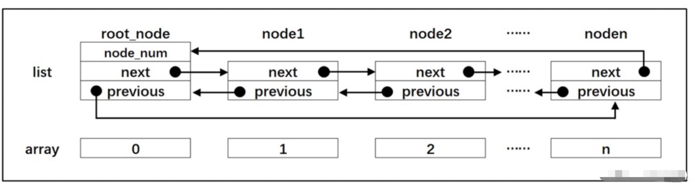

### 算法相关概念
---

1.线性时间复杂度
---
线性时间复杂度，时间复杂度为线性阶O(n)。

同一问题可以用不同的算法解决，而一个算法质量优劣（算法复杂度）可以由时间复杂度和空间复杂度来评价。

算法的时间复杂度是指执行算法所需要的时间工作量，即度量算法执行时间的长短，他定量描述了该算法的执行时间。

按数量级递增排列，常见的时间复杂度由：常数阶O(1)、对数阶O(log2n)、线性阶O(n)、线性对数阶O(nlog2n)、平方阶O(n^2)、立方阶O(n^3)……

随着问题规模n的不断扩大，时间复杂度不断增大，算法执行效率越低。

2.链表
---
链表作为C语言中一种基础的数据结构。可以分为单向链表和双向链表。

链表是一种物理存储上非连续、数据元素的逻辑顺序通过链表中的指针链接次序，实现的一种线性存储结构。

链表由一系列的节点组成，节点在运行时动态生成，每个节点包含两个部分，存储数据元素的**数据域**和存储下一个节点地址的**指针域**。
#### 链表和数组的区别：

    

1. 链表是通过节点把离散的数据链接成一个表，通过对节点的插入和删除从而实现对数据的存取。
2. 数组是通过开辟一段连续的内存来存取数据，这是链表和数组最大的区别。
3. 数组的每个成员对应链表的节点，成员和节点的数据类型可以是标准的C类型也可以是自定义结构体。
4. 数组有起始地址和结束地址，而链表是一个圈，没有头尾之分，但是为了方便节点的插入和删除操作会认为规定一个跟节点。